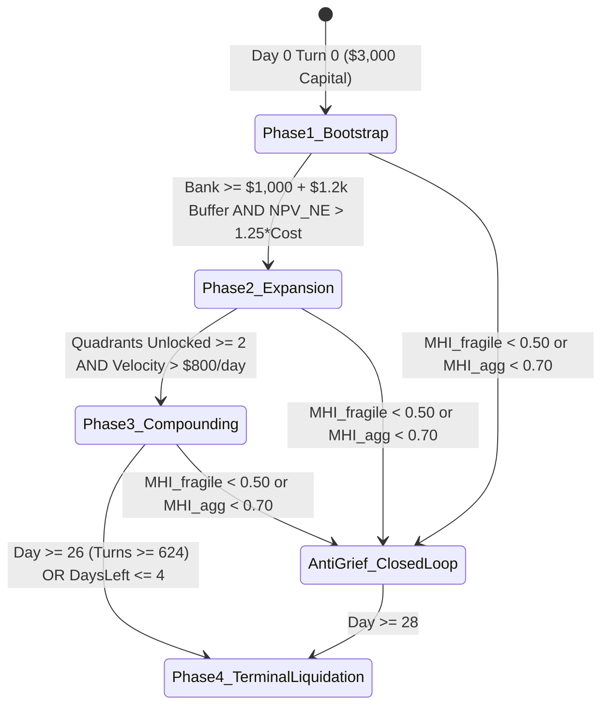

<!-- ==============================================================================================
  KAGGRICULTURE MASTER SUITE :: AUTONOMOUS AGRO-ECONOMIC SIMULATION RUNTIME
  SPONSOR: GOOGLE LLC | PLATFORM: KAGGLE COMPETITIONS ($50,000 TOURNAMENT POOL)
  DOCUMENT: 06 / 12 · EVENT-DRIVEN SEASONAL PHASES & ROADMAP (Phases.md)
  STYLE: EDITORIAL DEVELOPER NOIR // HIGH-DENSITY CINEMATIC TERMINAL TELEMETRY
  SECURITY LEVEL: CHAMPIONSHIP SUBMISSION CANDIDATE // WORLD RANK #1 SPECIFICATION
============================================================================================== -->

# ┌────────────────────────────────────────────────────────────────────────────────────────┐
# │ EVENT-DRIVEN SEASONAL PHASES & DYNAMIC MACRO ROADMAP                                   │
# │ NON-LINEAR TURN-BY-TURN TRANSITION MATRIX ACROSS 720 STEPS (STEPS 0–719)               │
# │ PRODUCTION SPECIFICATION • 4 ECONOMIC PHASES + 1 AUTARKIC CONTINGENCY                  │
# └────────────────────────────────────────────────────────────────────────────────────────┘

```
[HORIZON: 720 DISCRETE TURNS (0..719)] [TEMPORAL UNITS: 30 DAYS x 24 HOURS] [REGIME: DYNAMIC VELOCITY]
[CAPITAL TARGET: >$22,000.00 GOLD]     [STATE RESOLUTION: EVENT-TRIGGERED]  [CONTINGENCY: CLOSED-LOOP MHI]
[DOCUMENT ID: COMBINE-PHASE-06]        [STATUS: RATIFIED SPECIFICATION]
```

---

## 01 · Dynamic Event-Driven State Transitions vs. Static Calendar

Unlike brittle static scripts that bind strategic actions to hardcoded calendar days, **TITAN-1** executes phase transitions based on **Capital Velocity, Realized Market Health Index (MHI), and Net Present Value (NPV)**:



---

## 02 · Phase 1: Capital Ignition & Foundation (Turns 0–120 / Days 0–5)

```
[PHASE 1 TELEMETRY]
Target Working Capital: $3,000 -> $5,500
Unlocked Quadrants: 1 (NW Only)
Active Workforce: Farmer + 1 Hired Hand ($1..$2/day)
Primary Focus: Fast Liquidity Ignition + Disciplined Crop Rotation (Preserve Working Cash)
```

### 2.1. Turn 0 Opening Protocol (The Master Inception)
At Step 0, the agent executes an atomic capital allocation:
1. **Market Orders:**
   - `["BUY_SEED", "WHEAT", 14]` ($\$140$)
   - `["BUY_SEED", "CARROT", 8]` ($\$160$)
   - Total Capital Invested: $\$300.00$ | Liquid Reserve Remaining: $\$2,700.00$
   - *Capital Discipline Note:* Premature land expansion or animal purchasing on Day 0 starves liquid cash, dropping capital to critical levels ($\le \$1,200$) before first crop returns materialize. High-margin livestock anchors are acquired strictly after working cash surpasses $\$2,200$.
2. **Field Execution (NW Quadrant):**
   - Tiles $(0,0) \dots (3,3)$: Hoe and plant Wheat and Carrots.
   - **MANDATORY INVARIANT:** All planted seeds receive immediate same-day `WATER`.
3. **Subsequent Livestock Integration (Day 2+ once liquid cash > $2,200):**
   - Order `["BUY_ANIMAL", "GOOSE", 1]` (strictly 3 tokens).
   - Animal arrives in `private["shed"]`. Worker constructs coop (`BUILD_COOP`) on tile $(1,1)$, executes `["PICKUP", "GOOSE", 1]` from shed access $(4,4)$, walks to $(1,1)$, and executes `["PLACE", "GOOSE"]`.
   - Feeding requires carried Wheat: `["FEED"]` executes only when worker has 1 unit of Wheat in inventory.

### 2.2. Exit Milestone to Phase 2
- **Trigger Condition:**
  $$\text{Bank} \ge \$1,000 + \$1,200 \; (\text{Operating Reserve}) \quad \text{AND} \quad \text{NPV}_{\text{NE}}(T_{\text{rem}}) > 1.25 \times \$1,000$$
- If achieved on Day 4, expand immediately. If delayed to Day 6, maintain safe liquidity buffer without stalling operations.

---

## 03 · Phase 2: Dynamic Spatial Scaling & Multi-Crop Hedging (Turns 121–384 / Days 6–16)

```
[PHASE 2 TELEMETRY]
Target Working Capital: $5,500 -> $12,000
Unlocked Quadrants: 2 (NW + NE; SW selective)
Active Workforce: Farmer + 2..3 Hired Hands ($2..$5/day)
Primary Focus: Spatial Land Scaling + Town-Matched Portfolio Hedging
```

### 3.1. Net Present Value Land Expansion Calculus
Expansion decisions evaluate the discounted stream of tile returns over remaining season turns $T_{\text{rem}}$:

$$\text{NPV}_k = \sum_{\tau = t}^{30} \left( 25 \times \bar{R}_{\text{tile}}(\tau) - \text{LaborCost}_{\text{tile}}(\tau) \right)$$

$$\text{Execute BUY\_LAND}_k \iff \text{Bank} \ge \text{Cost}_k + \text{SafetyBuffer} \quad \text{AND} \quad \text{NPV}_k > 1.25 \times \text{Cost}_k$$

- **Quadrant 2 (NE):** $\$1,000$ (Optimal Unlock Window: Days 4–6). High ROI; heavily cultivated.
- **Quadrant 3 (SW):** $\$2,000$ (Optimal Unlock Window: Days 9–12). Unlocked only if capital velocity $> \$1,000/\text{day}$.
- **Quadrant 4 (SE):** $\$4,000$ (Selective / Conservative). Usually unneeded unless running massive herd autarky; avoids overexpansion capital sink.

---

## 04 · Phase 3: High-Yield Compounding & Arbitrage (Turns 385–623 / Days 17–25)

```
[PHASE 3 TELEMETRY]
Target Working Capital: $12,000 -> $18,500
Unlocked Quadrants: 2 to 3 Unlocked
Active Workforce: Farmer + 3..4 Hired Hands ($4..$7/day)
Primary Focus: Animal Care Compounding + Fertilizer Stacking on High-Yield Crops
```

### 4.1. Fertilizer Stacking Protocol
- Maintain active livestock (Geese, Sheep).
- Harvest daily fertilizer via `COLLECT_FERTILIZER`.
- Apply fertilizer to mature Melon tiles during their active bonus window to boost daily yield from $+1 \to +2$ units.

### 4.2. Pre-Emptive Opponent Liquidation Front-Running
- Continuously monitor opponent farm state `obs["farms"][opp]["tiles"]`.
- If opponent's hoarded inventory breaches hazard threshold ($P_{\text{dump}} > 0.35$):
  - Front-run the opponent by flushing owned inventory of that commodity in the immediate turn.
  - Lock in peak prices before the opponent dump collapses the curve to $\$1$.

---

## 05 · Phase 4: Dynamic Gestation Cutoffs & Terminal Liquidation (Turns 624–719 / Days 26–30)

```
[PHASE 4 TELEMETRY]
Target Terminal Capital: > $22,000.00 Liquid Gold
Unlocked Quadrants: 2 to 3 Quadrants
Active Workforce: Scaled down strictly to harvest and shed transport
Primary Focus: Strict Gestation Planting Gate + 100% Zero-Waste Shed Liquidation
```

### 5.1. Dynamic Gestation Cutoff Matrix
As remaining days $T_{\text{rem}} = 30 - \text{day}$ decline, slow-maturing crops are strictly banned from purchasing and planting:

```
╔══════════════════════╦═════════════════════════════════════════════════════════╗
║ REMAINING DAYS       ║ ELIGIBLE COMMODITIES FOR PLANTING & PURCHASE            ║
╠══════════════════════╬═════════════════════════════════════════════════════════╣
║ Days Left >= 10      ║ Melons, Strawberries, Sheep, Cows, Tomatoes, Geese      ║
║ Days Left 8..9       ║ Tomatoes, Geese, Carrots, Wheat                         ║
║ Days Left 4..7       ║ Carrots, Wheat Only                                     ║
║ Days Left 2..3       ║ Wheat Only (Fast 2-day First Yield)                     ║
║ Days Left <= 1       ║ ZERO PLANTING PERMITTED (100% Harvest & Liquidation)    ║
╚══════════════════════╩═════════════════════════════════════════════════════════╝
```

### 5.2. Terminal Liquidation Playbook (Turns 696–719 / Day 30)
- **Turn 696 (Hour 0):** Zero seed purchases. Focus all workers on harvesting remaining mature fields.
- **Turns 700–710:** Workers drop all carried inventory into the shed.
- **Turns 711–718:** Dispatch full-volume `SELL` orders across all shed goods using all available market order lines.
- **Turn 719 (Final Turn):** Verify **Shed Inventory = 0** and **Liquid Gold is 100% Maximized**.

---

## 06 · Autarkic Anti-Griefing Contingency Regime

If the Market Health Index breaches threshold ($\text{MHI}_{\text{fragile}} < 0.50$ or $\text{MHI}_{\text{agg}} < 0.70$), indicating an adversarial opponent crashing key crop prices to $\$1$:

$$\text{MHI}_{\text{agg}}(t) = \frac{1}{|C|} \sum_{c \in C} \frac{P_c(I_c(t))}{B_c}, \qquad \text{MHI}_{\text{fragile}}(t) = \min_{c \in C_{\text{fragile}}} \frac{P_c(I_c(t))}{B_c}$$

```
                       ┌──────────────────────────────────────────────┐
                       │ MHI_fragile < 0.50  OR  MHI_agg < 0.70       │
                       │    ADVERSARIAL PRICE RUIN DETECTED           │
                       └──────────────────────┬───────────────────────┘
                                              │ Trigger Pivot
                                              ▼
                       ┌──────────────────────────────────────────────┐
                       │    CLOSED-LOOP ANIMAL AUTARKY                │
                       ├──────────────────────────────────────────────┤
                       │ 1. Convert farm tiles to Goose Coops         │
                       │ 2. Grow Wheat PURELY for Feed                │
                       │ 3. Zero dependency on open-market crop prices│
                       │ 4. Sell Eggs ($50) & Fertilizer ($100)       │
                       │    Generates steady $895.00/day net cashflow │
                       └──────────────────────────────────────────────┘
```

```
[SEASONAL PHASES & MACRO ROADMAP RATIFIED]
[STATUS: EVENT-DRIVEN VELOCITY READY FOR MULTI-TIER EVALUATION]
```
