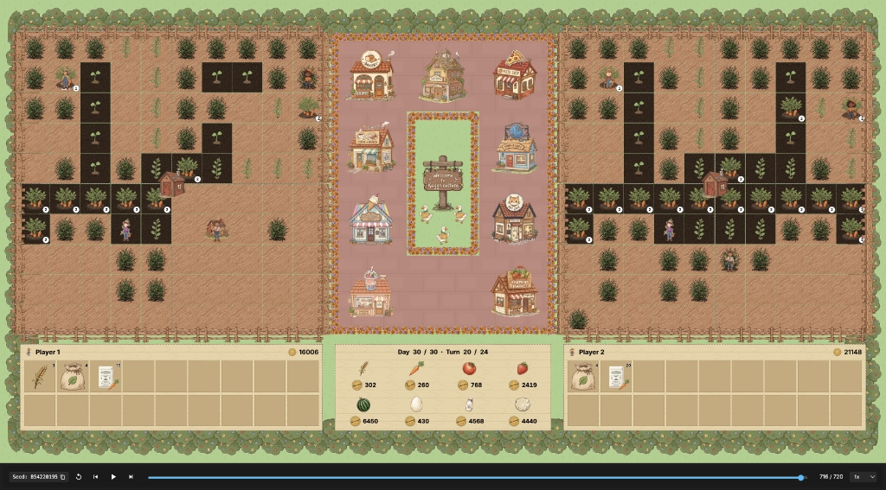
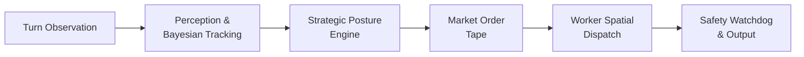

<div align="center">

# 🌾 TITAN-1 — Kaggriculture Championship Agent

**Autonomous agro-economic simulation engine for the Kaggle × Google LLC Kaggriculture tournament**

[](https://github.com/Adityaraj1969/Kaggriculture/actions/workflows/ci.yml)
[](https://www.python.org)
[](https://github.com/Kaggle/kaggle-environments)
[](LICENSE)
[](#benchmark-results)
[](#benchmark-results)

<br>



</div>

---

## Overview

[Kaggriculture](https://www.kaggle.com/competitions/kaggriculture) is a competitive simulation hosted by **Kaggle** and sponsored by **Google LLC** (\$50,000 prize pool). Two autonomous agents manage rival 10×10 agricultural estates across 720 turns (30 in-game days), competing for the highest liquid bank balance.

**TITAN-1** treats Kaggriculture not as a simple farming game, but as a **market microstructure and capital velocity problem** — combining Bayesian opponent tracking, non-linear price simulation, adaptive strategic postures, and real-time spatial logistics into a single sub-10ms decision loop.

### Key Results

| Metric | Value |
|---|---|
| Tournament Win Rate | **10/10 (100%)** vs Kaggle `starter` baseline |
| Mean Final Capital | **\$29,049** (vs \$3,604 opponent avg) |
| Relative Advantage | **+706%** over baseline |
| Per-Turn Latency | **< 5.2 ms** (limit: 1,000 ms) |

---

## Architecture

TITAN-1 runs as a deterministic, single-threaded, 5-tier pipeline that processes each turn observation within a 40ms safety budget:



| Tier | Component | Responsibility |
|---:|---|---|
| 1 | **Perception & Bayesian Tracking** | Parse terrain grid, reconstruct opponent shed inventory via market delta reconciliation |
| 2 | **Strategic Posture Engine** | Set posture (BALANCED / LEADING / TRAILING / ENDGAME / AUTARKY) based on bank gap and market health |
| 3 | **Market Order Tape** | Emit up to 10 orders per turn — selling, land expansion, hiring, livestock, seeds |
| 4 | **Worker Spatial Dispatch** | Route farmer + hired hands over the walkable mesh using priority-based task targeting |
| 5 | **Safety Watchdog** | Schema validation, coordinate bounds, 40ms circuit breaker, guaranteed legal fallback |

### Strategic Postures

```
  Bank Gap > +$3,000  →  LEADING    (conservative: lock in margin, fast-turnover staples)
  Bank Gap < -$3,000  →  TRAILING   (aggressive: high-margin crops, livestock compounding)
  Market collapsed    →  AUTARKY    (defensive: wheat-only, decouple from crashed market)
  Day >= 29           →  ENDGAME    (liquidation: dump all shed inventory for cash)
  Otherwise           →  BALANCED   (adaptive: diversified portfolio, moderate selling)
```

---

## Repository Structure

```
Kaggriculture/
├── main.py                       # Self-contained competition submission (~35 KB)
├── pyproject.toml                # Build config, ruff, mypy, pytest settings
├── requirements.txt              # Runtime dependencies
├── requirements-dev.txt          # Dev/test dependencies
├── Makefile                      # Shortcuts: test, benchmark, lint, package
├── LICENSE                       # MIT License
│
├── src/titan/                    # Modular development-time package
│   ├── __init__.py               # Package exports
│   ├── constants.py              # Crops, animals, market params, town shops
│   ├── pricing.py                # Non-linear price curves & shape functions
│   ├── tracker.py                # Bayesian opponent mass-balance tracker
│   ├── navigation.py             # Manhattan pathfinding & priority targeting
│   ├── strategy.py               # MHI calculation & posture engine
│   └── agent.py                  # Full agent implementation
│
├── tests/                        # Automated test suite (15 tests)
│   ├── test_pricing.py           # 27-point boundary price verification
│   ├── test_tracker.py           # Bayesian tracking & shop drain tests
│   ├── test_navigation.py        # Quadrant mapping & pathfinding tests
│   ├── test_invariants.py        # Schema, batch caps, fault isolation
│   └── test_simulation.py        # 720-turn end-to-end integration test
│
├── tools/                        # CLI utilities
│   ├── benchmark.py              # Multi-seed tournament benchmark
│   ├── evaluate_league.py        # Adversarial league evaluation
│   ├── render_replay.py          # Match visualizer & HTML replay export
│   └── package_submission.py     # Pre-flight validator & archive builder
│
├── docs/                         # Technical specification suite
│   ├── PRD.md                    # Product requirements & SLA definitions
│   ├── Rules.md                  # Engine formulas & game mechanics
│   ├── Architecture.md           # 5-tier system architecture
│   ├── Design.md                 # Algorithmic design & task scheduling
│   ├── AI_Strategy.md            # Game theory & opponent modeling
│   ├── Phases.md                 # Development lifecycle roadmap
│   ├── Evaluation.md             # League evaluation methodology
│   ├── Validation.md             # Deployment gates & test fixtures
│   ├── code_quality.md           # Engineering standards
│   ├── Demo.md                   # Demonstration runbook
│   └── UI_UX_designed.md         # Terminal telemetry design
│
└── .github/workflows/ci.yml     # CI: lint, type check, test, benchmark
```

> **Note:** `main.py` is a fully self-contained copy of the agent for Kaggle submission. `src/titan/` is the equivalent modular package used for development and testing.

---

## Getting Started

### Prerequisites

- Python 3.10 or later
- pip

### Installation

```bash
git clone https://github.com/Adityaraj1969/Kaggriculture.git
cd Kaggriculture

# Create a virtual environment (recommended)
python -m venv .venv
.venv\Scripts\activate        # Windows
# source .venv/bin/activate   # macOS/Linux

pip install -r requirements-dev.txt
```

### Run a Match

```bash
# Single match against the Kaggle starter bot
python -c "
from kaggle_environments import make
env = make('kaggriculture', configuration={'episodeSteps': 720, 'seed': 42}, debug=True)
env.run(['main.py', 'starter'])
final = env.steps[-1]
print(f'TITAN-1: {final[0].reward:,.0f}  |  Starter: {final[1].reward:,.0f}')
"
```

### Run the Benchmark

```bash
# 10-seed tournament with deployment gate checks
python tools/benchmark.py --seeds 1,2,3,4,5,42,100,256,777,999

# Or via Makefile
make benchmark
```

### Watch a Replay

```bash
# Generate an interactive HTML replay and open it in the browser
python tools/render_replay.py --seed 42

# Self-play (both sides use TITAN-1)
python tools/render_replay.py --agent main.py --opponent main.py --output replays/self_play.html
```

### Run Tests

```bash
python -m unittest discover -s tests -p "test_*.py" -v

# Or via Makefile
make test
```

### Submit to Kaggle

```bash
# Validate and package
python tools/package_submission.py

# Upload
kaggle competitions submit -c kaggriculture -f main.py -m "v2.0"
```

---

## Benchmark Results

All results from complete 720-turn matches on the official `kaggle_environments` engine against the platform `starter` baseline:

| Seed | TITAN-1 | Starter | Margin | Result |
|---:|---:|---:|---:|:---:|
| 1 | \$28,577 | \$3,501 | +\$25,076 | ✅ WIN |
| 2 | \$29,671 | \$3,684 | +\$25,987 | ✅ WIN |
| 3 | \$27,662 | \$3,936 | +\$23,726 | ✅ WIN |
| 4 | \$28,704 | \$3,532 | +\$25,172 | ✅ WIN |
| 5 | \$28,553 | \$3,645 | +\$24,908 | ✅ WIN |
| 42 | \$30,117 | \$3,464 | +\$26,653 | ✅ WIN |
| 100 | \$28,382 | \$3,592 | +\$24,790 | ✅ WIN |
| 256 | \$29,369 | \$3,516 | +\$25,853 | ✅ WIN |
| 777 | \$29,807 | \$3,637 | +\$26,170 | ✅ WIN |
| 999 | \$29,649 | \$3,536 | +\$26,113 | ✅ WIN |
| **Avg** | **\$29,049** | **\$3,604** | **+\$25,445** | **100%** |

---

## How It Works

### Market Price Simulation

TITAN-1 replicates the engine's exact non-linear price curves to predict revenue before selling. Each commodity has a base price, an equilibrium inventory level, and asymmetric elasticity functions (sqrt, log, hinge, quadratic) that govern price response to supply gluts and scarcity.

### Bayesian Opponent Tracking

Opponent shed contents are private, but market inventory changes and town shop consumption are public. By reconciling these observable signals against our own trades, TITAN-1 estimates what the opponent is hoarding and computes a **dump hazard probability** — triggering pre-emptive selling before an anticipated price crash.

### Leaky-Bucket Liquidation

For fragile commodities (Melon, Wool, Strawberry, Milk) where prices collapse quadratically under oversupply, TITAN-1 caps per-turn sales to calculated headroom thresholds. On the final day (turns 696–719), the terminal liquidation engine bypasses all limits and dumps 100% of shed inventory.

---

## CI Pipeline

Every push to `main` triggers:

1. **Ruff** — lint checking (pycodestyle, pyflakes, isort, bugbear, pyupgrade)
2. **Mypy** — static type analysis
3. **Unit Tests** — 15 tests covering pricing, navigation, tracking, invariants
4. **Simulation Benchmark** — 3-seed quick verification with 100% win rate gate

---

## Documentation

Detailed technical specifications are in the [`docs/`](docs/) directory:

| Document | Contents |
|---|---|
| [PRD.md](docs/PRD.md) | Requirements, failure modes, SLA definitions |
| [Rules.md](docs/Rules.md) | Engine formulas, crop/animal/market tables |
| [Architecture.md](docs/Architecture.md) | 5-tier pipeline design & latency budgets |
| [Design.md](docs/Design.md) | Algorithm details & task scheduling |
| [AI_Strategy.md](docs/AI_Strategy.md) | Game theory & opponent modeling |
| [Validation.md](docs/Validation.md) | Deployment gates & test methodology |

---

## License

This project is licensed under the MIT License — see [LICENSE](LICENSE) for details.
