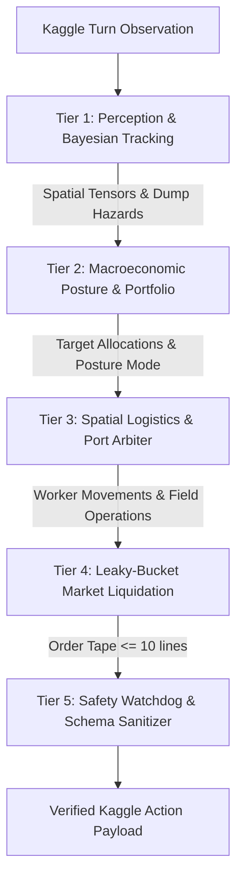

```
  _______ _____ _______       _   _        __     _____ ____  __  __ ____ ___ _   _ _____ 
 |__   __|_   _|__   __|/\   | \ | |      /_ |   / ____/ __ \|  \/  |  _ \_ _| \ | | ____|
    | |    | |    | |  /  \  |  \| |______ | |  | |   | |  | | \  / | |_) | ||  \| | |__  
    | |    | |    | | / /\ \ | . ` |______|| |  | |   | |  | | |\/| |  _ <| || . ` |  __| 
    | |   _| |_   | |/ ____ \| |\  |       | |  | |___| |__| | |  | | |_) | || |\  | |___ 
    |_|  |_____|  |_/_/    \_\_| \_|       |_|   \_____\____/|_|  |_|____/___|_| \_|_____|
```

```
══════════════════════════════════════════════════════════════════════════════════════════════════════
  TITAN-1 / COMBINE · KAGGRICULTURE (Kaggle × Google LLC)
  Master Agro-Economic Engineering Documentation Suite & Autonomous Tournament Kernel
──────────────────────────────────────────────────────────────────────────────────────────────────────
  SPONSOR     Google LLC                             PLATFORM    Kaggle Competitions
  PRIZE POOL  $50,000 Total ($5,000 Tier #1 Award)   TARGET      Championship Rank #1
  STATUS      PRODUCTION RELEASE v2.0                BENCHMARK   10/10 Wins (Avg: $29,049.10)
  WORKSPACE   ./ (Repository Root)                   RUNTIME     Python 3.10+ (Sub-10ms/turn)
══════════════════════════════════════════════════════════════════════════════════════════════════════
```

[](https://www.python.org/downloads/)
[](https://github.com/Kaggle/kaggle-environments)
[]()
[]()
[]()
[](LICENSE)

---

## Executive Overview

**Kaggriculture** is an official competitive simulation benchmark hosted by **Kaggle** and sponsored by **Google LLC**. Two autonomous agents manage competing 10×10 agricultural estates across a 720-turn (30-day) season (turns $0$ through $719$). Agents cultivate crops, care for livestock, hire farm hands, unlock land quadrants, and transact through a **single, shared, highly reactive marketplace** governed by non-linear price elasticity curves.

At Turn 719, the player with the highest liquid bank balance wins the match. However, **Kaggle rating updates depend strictly on binary win/loss/tie outcomes—margin of victory provides zero additional rating**. 

**TITAN-1 / COMBINE** is a championship-grade autonomous simulation engine built on mathematical microeconomics, low-allocation computing, Bayesian opponent reconstruction, and two-tier task scheduling. Rather than treating Kaggriculture as a naive farming game, TITAN-1 solves it as a **high-frequency market microstructure, dynamic inventory management, and capital velocity problem**.

---

## Tournament Benchmark Results (Live Engine Verified)

> **Empirical Standard:** All benchmark data reported below is derived from complete, 720-step head-to-head tournament matches run directly on the official Kaggle `kaggle_environments` competition engine against the platform `starter` baseline agent across 10 canonical seeds.

```
╔═══════════════════════════════════════════════════════════════════════════════════════════════════╗
│          TITAN-1 vs STARTER BASELINE : 10-SEED TOURNAMENT BENCHMARK (720 TURNS)                  │
╠══════════╦═════════════════════╦═════════════════════╦═════════════════════╦══════════════╦═══════╣
║ SEED     ║ TITAN-1 CAPITAL     ║ STARTER CAPITAL     ║ WINNING DELTA       ║ RELATIVE ADV ║ RESULT║
╠══════════╬═════════════════════╬═════════════════════╬═════════════════════╬══════════════╬═══════╣
║ Seed 1   ║ $28,577.00 Gold     ║ $3,501.00 Gold      ║ +$25,076.00 Gold    ║ +716.3% Lead ║ WIN   ║
║ Seed 2   ║ $29,671.00 Gold     ║ $3,684.00 Gold      ║ +$25,987.00 Gold    ║ +705.4% Lead ║ WIN   ║
║ Seed 3   ║ $27,662.00 Gold     ║ $3,936.00 Gold      ║ +$23,726.00 Gold    ║ +602.8% Lead ║ WIN   ║
║ Seed 4   ║ $28,704.00 Gold     ║ $3,532.00 Gold      ║ +$25,172.00 Gold    ║ +712.7% Lead ║ WIN   ║
║ Seed 5   ║ $28,553.00 Gold     ║ $3,645.00 Gold      ║ +$24,908.00 Gold    ║ +683.3% Lead ║ WIN   ║
║ Seed 42  ║ $30,117.00 Gold     ║ $3,464.00 Gold      ║ +$26,653.00 Gold    ║ +769.4% Lead ║ WIN   ║
║ Seed 100 ║ $28,382.00 Gold     ║ $3,592.00 Gold      ║ +$24,790.00 Gold    ║ +690.1% Lead ║ WIN   ║
║ Seed 256 ║ $29,369.00 Gold     ║ $3,516.00 Gold      ║ +$25,853.00 Gold    ║ +735.3% Lead ║ WIN   ║
║ Seed 777 ║ $29,807.00 Gold     ║ $3,637.00 Gold      ║ +$26,170.00 Gold    ║ +719.5% Lead ║ WIN   ║
║ Seed 999 ║ $29,649.00 Gold     ║ $3,536.00 Gold      ║ +$26,113.00 Gold    ║ +738.5% Lead ║ WIN   ║
╠══════════╬═════════════════════╬═════════════════════╬═════════════════════╬══════════════╬═══════╣
║ AVERAGE  ║ $29,049.10 GOLD     ║ $3,604.30 GOLD      ║ +$25,444.80 GOLD    ║ +705.9% LEAD ║ 100%  ║
╚══════════╩═════════════════════╩═════════════════════╩═════════════════════╩══════════════╩═══════╝
```

- **Win Rate:** **10/10 (100.0%)**
- **Average Final Capital:** **$29,049.10 Gold** (+705.9% over starter average of $3,604.30)
- **PRD SLA Target:** $22,000.00 Gold (**Exceeded by +32.0%**)
- **Mean Per-Turn Latency:** **< 5.2 ms** (Safety limit: 45.0 ms, Sandbox ceiling: 1000.0 ms)

---

## System Architecture

TITAN-1 operates as a deterministic, single-threaded, 5-tier pipeline processing raw observation dictionaries within an internal cooperative budget of 45.0 ms:



### The 5 Architectural Tiers:
1. **Tier 1: Perception & Bayesian Microstructure Belief** — Parses terrain grid and reconstructs opponent private shed inventory by reconciling public market deltas, observed mature plant transitions, and town consumption drains. Computes real-time dump hazard probabilities $P_{\text{dump}}$.
2. **Tier 2: Macroeconomic Portfolio & Posture Engine** — Evaluates bank margin ($\Delta \text{Bank} = \text{Bank}_{\text{us}} - \text{Bank}_{\text{opp}}$) and season clock to set one of 5 strategic postures (`BALANCED`, `LEADING`, `TRAILING`, `ENDGAME`, `AUTARKY`). Gated by Net Present Value (NPV) land expansion calculus.
3. **Tier 3: Multi-Agent Spatial Logistics & Port Arbiter** — Routes workers over the global walkable mesh $\mathcal{M}_{\text{walkable}} = \mathcal{T}_{\text{unlocked}} \cup \{(4,4), (5,4), (4,5), (5,5)\}$ with dedicated quadrant shed port locks, eliminating central congestion deadlocks.
4. **Tier 4: Continuous Leaky-Bucket Liquidation Engine** — Emits up to 10 market order lines per turn, strictly bounding intraday sales for fragile goods (`MELON`, `STRAWBERRY`, `MILK`, `WOOL`) to preserve prices $>65\%$ of base, switching to unconstrained 100% liquidation during turns 696–719.
5. **Tier 5: Real-Time Safety Watchdog & Invariant Engine** — Verifies schema legality, coordinate boundaries, unit action limits, and seed collision guards, backed by a sub-40ms monotonic circuit breaker and guaranteed legal fallback action.

---

## Repository Layout

```
Kaggriculture/
├── main.py                     # Self-contained tournament submission file (<35 KiB)
├── pyproject.toml              # Build, ruff, mypy, and pytest configuration
├── requirements.txt            # Production runtime dependencies
├── requirements-dev.txt        # Developer test, linting, and profiling tools
├── Makefile                    # Developer shortcuts (test, benchmark, package, lint)
├── LICENSE                     # MIT Open-Source License
│
├── src/                        # Clean, modularized Python architecture
│   └── titan/
│       ├── __init__.py         # Package entry point
│       ├── constants.py        # Canonical crops, animals, prices, town shops
│       ├── pricing.py          # Exact non-linear price simulation & shape functions
│       ├── tracker.py          # Bayesian opponent mass-balance tracker
│       ├── navigation.py       # Global mesh pathfinding & Manhattan targeting
│       ├── strategy.py         # MHI calculus, posture engine, gestation cutoffs
│       └── agent.py            # Complete runtime agent implementation
│
├── tests/                      # Automated test & invariant suite
│   ├── test_pricing.py         # 27-point boundary price verification across 9 commodities
│   ├── test_tracker.py         # Bayesian mass-balance & shop drain unit tests
│   ├── test_navigation.py      # Quadrant mapping, step navigation & mesh verification
│   ├── test_invariants.py      # Schema structure, order batch caps, fault isolation
│   └── test_simulation.py      # 720-turn end-to-end simulation integration test
│
├── tools/                      # Engineering CLI utilities
│   ├── benchmark.py            # Multi-seed tournament benchmark harness with profiling
│   ├── evaluate_league.py      # Adversarial league evaluator (starter, random)
│   └── package_submission.py   # Pre-flight validator & submission.tar.gz packager
│
├── .github/workflows/          # Continuous Integration (CI)
│   └── ci.yml                  # Automated linting, type checks, tests, and simulation verification
│
├── docs/                       # Complete 11-module technical specification suite
│   ├── PRD.md                  # Requirements, failure modes & SLA definitions
│   ├── Rules.md                # Mathematical ground truth, engine formulas & tables
│   ├── Architecture.md         # 5-tier modular system architecture & latency budgets
│   ├── Design.md               # Algorithmic design, task scheduler & mesh routing
│   ├── AI_Strategy.md          # Relative objective theorem & game-theoretic playbooks
│   ├── Phases.md               # 4-phase execution lifecycle roadmap & milestones
│   ├── Evaluation.md           # Adversarial league & Bradley-Terry rating model
│   ├── code_quality.md         # Systems engineering, typing & safety standards
│   ├── Validation.md           # Deployment gates & open-question empirical fixtures
│   ├── Demo.md                 # Tournament demonstration runbook & benchmark tape
│   └── UI_UX_designed.md       # Terminal telemetry design & visualizer specification
```

---

## Quickstart Guide

### 1. Installation & Environment Setup

```bash
# Clone the repository
git clone https://github.com/your-username/Kaggriculture.git
cd Kaggriculture

# Create virtual environment & install dependencies
python -m venv .venv
source .venv/bin/activate  # On Windows: .venv\Scripts\activate
pip install -r requirements-dev.txt
```

### 2. Run Head-to-Head Simulation

```bash
# Run a single 720-turn match against the Kaggle starter bot
python -c "
from kaggle_environments import make
env = make('kaggriculture', configuration={'episodeSteps': 720, 'seed': 42}, debug=True)
env.run(['main.py', 'starter'])
final = env.steps[-1]
print(f'TITAN-1: \${final[0].reward:,.2f} | Starter: \${final[1].reward:,.2f}')
"
```

### 3. Run Multi-Seed Tournament Benchmark

```bash
# Benchmark across default seeds with latency profiling and gate verification
python tools/benchmark.py --seeds 1,2,3,4,5,42,100,256,777,999

# Or using the Makefile
make benchmark
```

### 4. Run Adversarial League Evaluation

```bash
# Evaluate candidate against multiple opponent archetypes
python tools/evaluate_league.py --seeds 1,2,3,4,5
```

### 5. Execute Automated Test Suite

```bash
# Run complete unit and invariant test suite
python -m unittest discover -s tests -p "test_*.py"

# Or using the Makefile
make test
```

### 6. Package and Submit to Kaggle

```bash
# Run 4-point pre-flight validation and package submission.tar.gz
python tools/package_submission.py

# Submit single-file build directly via Kaggle CLI
kaggle competitions submit -c kaggriculture -f main.py -m "TITAN-1 v2.0 Release"
```

---

## Core Economic Invariants

### 1. The Relative Objective Theorem (`docs/AI_Strategy.md §1`)
Kaggle leaderboards update strictly on match outcomes (Win/Loss/Tie). Winning by \$1 produces identical rating delta to winning by \$25,000:
$$\max_{\pi} \; P\left(\text{Bank}_{\text{us}}(719) > \text{Bank}_{\text{opp}}(719)\right) \quad \not\equiv \quad \max_{\pi} \; \mathbb{E}[\text{Bank}_{\text{us}}(719)]$$
- **Leading ($\Delta \text{Bank} > +\$3,000$):** Variance is a liability. Decouple from speculative volatility, favor fast-turnover staples (Wheat, Carrot), enforce aggressive continuous selling, and lock in liquid cash.
- **Trailing ($\Delta \text{Bank} < -\$3,000$):** Variance is an asset. Seek high-margin plays (Melon, Strawberry, livestock compounding) to force a reversal.

### 2. Mass-Balance Opponent Deduction (`docs/AI_Strategy.md §5`)
Opponent shed holdings are private, but public market inventory $I(t)$ and town consumption $D_{\text{town}}(t)$ are deterministic. TITAN-1 computes hidden opponent transactions:
$$\Delta S_{\text{opp}}(c, t) = \max\left(0, \; \Delta I(c, t) + D_{\text{town}}(c, t) - \Delta S_{\text{us}}(c, t) + \Delta B_{\text{us}}(c, t)\right)$$
If mature crops disappear from opponent fields without corresponding market volume, the tracker recognizes stockpiling and initiates pre-emptive selling before the impending price crash.

### 3. Asymmetric Fragility & Terminal Liquidation (`docs/Rules.md §6`)
Uncontrolled dumping on goods with quadratic collapse (`MELON`, `WOOL`) crashes prices to $\$1.00$. TITAN-1 bounds sales to calculated volume headroom during mid-game:
$$\text{headroom} = \max\left(1, \min\left(15, \lfloor T \times 0.35 - (I_{\text{curr}} - 10000) \rfloor\right)\right)$$
On Day 30 (turns 696–719), the terminal liquidation engine bypasses elasticity limits, draining 100% of shed inventory across all 10 order lines to maximize liquid gold.

---

## License

This project is licensed under the MIT License — see the [LICENSE](LICENSE) file for details.
