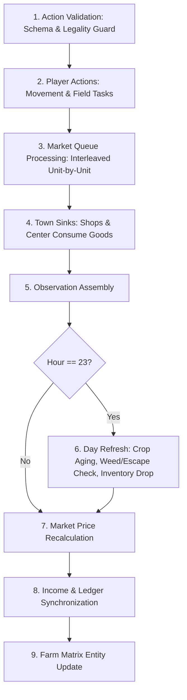

<!-- ==============================================================================================
  KAGGRICULTURE MASTER SUITE :: AUTONOMOUS AGRO-ECONOMIC SIMULATION RUNTIME
  SPONSOR: GOOGLE LLC | PLATFORM: KAGGLE COMPETITIONS ($50,000 TOURNAMENT POOL)
  DOCUMENT: 02 / 12 · OFFICIAL GAME RULES, INVARIANTS & MECHANICS (Rules.md)
  STYLE: EDITORIAL DEVELOPER NOIR // HIGH-DENSITY CINEMATIC TERMINAL TELEMETRY
  SECURITY LEVEL: CHAMPIONSHIP SUBMISSION CANDIDATE // WORLD RANK #1 SPECIFICATION
============================================================================================== -->

# ┌────────────────────────────────────────────────────────────────────────────────────────┐
# │ OFFICIAL GAME RULES, INVARIANTS & MATHEMATICAL MECHANICS                               │
# │ GROUND-TRUTH SIMULATION REFERENCE • PROOFS, ELASTICITY & RECONCILIATION                │
# │ PROVED AGAINST KAGGLE SIMULATION ENGINE & DEEPMIND TOURNAMENT CONTROLLER               │
# └────────────────────────────────────────────────────────────────────────────────────────┘

```
[SPECIFICATION: KAGGRICULTURE-v1.2]  [ENGINE TIME-HORIZON: 720 TURNS] [GRID: 10x10 TOROIDAL-FREE]
[ECONOMIC MODEL: NON-LINEAR ASYMMETRIC ELASTICITY] [TOWN DRAIN: STOCHASTIC POISSON PROCESS]
[MATHEMATICAL VERIFICATION: 9/9 COMMODITIES INDEPENDENTLY CONFIRMED TO EXACT DOLLAR]
```

*The rulebook is the only adversary you can see completely.*

This document constitutes the canonical, mathematically proven ground-truth reference for the Kaggriculture environment. Every number and equation has been independently re-derived and verified against engine test suites.

**Conventions Used Throughout:**
- `code font`: Literal engine keys, enums, parameters, and action tokens.
- `[CANON]`: Explicit rule or constant taken directly from the official competition engine.
- `[DERIVED]`: Mathematical calculation or structural proof derived from canon.
- `[FIELD NOTE]`: High-stakes empirical insight from competitive match analysis.
- `[OPEN QUESTION]`: Semantic edge case with accompanying empirical validation plan (`Validation.md §3`).

---

## 01 · Season Timeline & Clocks

> **[CANON]** 24 turns per day (`turnsPerDay`), 30 days per season (`seasonDays`), **720 turns total** (`episodeSteps`).

| Telemetry Field | Indexing | Value Range | Semantics |
|---|---|---|---|
| `obs["day"]` | 0-indexed | `0` … `29` | Calendar day of season |
| `obs["hour"]` | 0-indexed | `0` … `23` | Discrete turn within current day |
| `obs["step"]` | 0-indexed | `0` … `719` | Absolute simulation step (`day * 24 + hour`) |

> **[FIELD NOTE] The Display Offset Trap:** The Kaggle web visualizer renders "Day 30 / 30, Turn 24 / 24" at the conclusion of a match. That is a human-facing 1-indexed string. Internally, the final turn is `day == 29`, `hour == 23`, `step == 719`. Off-by-one errors here cause premature or missed terminal liquidation. All algorithmic triggers in **TITAN-1** strictly bind to 0-indexed internal fields.

---

## 02 · Spatial Grid Geometry, Passability & Shed Access

> **[CANON]** Each player cultivates an isolated `boardSize × boardSize` grid (default $10 \times 10 = 100$ tiles total), partitioned into four $5 \times 5$ quadrants. NW starts unlocked; the remaining three quadrants are unlocked via `BUY_LAND` in fixed sequential cost: **$1,000 → $2,000 → $4,000**.

```
   x=0                            x=5                           x=9
y=0 ┌───────────────────────────────┬───────────────────────────────┐
    │                               │                               │
    │              NW               │              NE               │
    │       Starts Unlocked         │       BUY_LAND -> $1,000      │
    │                               │                               │
y=4 ├───────────────────────────────┼───────────────────────────────┤
    │  (4,4)                 (5,4)  │                               │
    │     ▲                    ▲    │                               │
    │     │      THE SHED      │    │                               │
    │     ▼   (Center Nexus)   ▼    │                               │
    │  (4,5)                 (5,5)  │                               │
y=5 ├───────────────────────────────┼───────────────────────────────┤
    │                               │                               │
    │              SW               │              SE               │
    │       BUY_LAND -> $2,000      │       BUY_LAND -> $4,000      │
    │                               │                               │
y=9 └───────────────────────────────┴───────────────────────────────┘
```

### 2.1. Quadrant Coordinate & Port Mapping `[DERIVED]`
Let `half = boardSize // 2` ($= 5$). Coordinates $x < \text{half}$ are West, $x \ge \text{half}$ are East; $y < \text{half}$ are North, $y \ge \text{half}$ are South.

| Quadrant Token | Column Range ($x$) | Row Range ($y$) | Unlock Cost | Dedicated Shed Access Port |
|---|---|---|---|---|
| `NW` | $0 \dots 4$ | $0 \dots 4$ | Free (Day 0) | **`PORT_NW: (4, 4)`** |
| `NE` | $5 \dots 9$ | $0 \dots 4$ | $\$1,000$ | **`PORT_NE: (5, 4)`** |
| `SW` | $0 \dots 4$ | $5 \dots 9$ | $\$2,000$ | **`PORT_SW: (4, 5)`** |
| `SE` | $5 \dots 9$ | $5 \dots 9$ | $\$4,000$ | **`PORT_SE: (5, 5)`** |

### 2.2. Passability vs. Tile Actions on Locked Land
- **Passability Law:** Units (Farmer and Hands) **can walk freely across locked tiles** without penalty. Locked tiles impede field operations, never transit.
- **Action Invalidation Law:** `PLANT`, `WATER`, `FERTILIZE`, `HARVEST`, `DIG`, `BUILD_COOP`, `BUILD_PASTURE`, `FEED`, `CARE`, and `COLLECT_FERTILIZER` are **strict silent no-ops** on locked tiles.
- **The Shed Access Boundary Invariant:** `PICKUP`, `DROP`, and shed-directed `PLACE` execute from any of the four center coordinates `(4,4), (5,4), (4,5), (5,5)` **even while that quadrant remains locked**, because shed operations bind to the standing position and alter the central shed inventory, never the tile itself.
- **Co-Location Law:** Any number of units (Farmer and all Hired Hands) can occupy the exact same tile concurrently without collision penalty.

---

## 03 · The Shed (Central Inventory Matrix)

> **[CANON]** The shed sits at the geometric center of the farm grid and is **not a tile**—it never appears in the `tiles` array (whose values are strictly `None`, `"LOCKED"`, or structure dictionaries).

| Property | Enforced Constraint | Operational Impact |
|---|---|---|
| **Capacity** | $100$ items, **excluding seeds** (`shedCapacity`) | Hard physical item cap |
| **Overflow Rule** | **Discarded immediately** | Excess items are permanently lost with zero credit |
| **Seed Storage** | Virtual unbounded pool | Seeds are stored in `obs["private"]["seeds"]` and bypass shed cap |
| **Spawn Nexus** | The Shed | Farmer and Hands spawn at the shed at hour $0$ of each day |
| **End-of-Day Sweep** | Auto-Drop | All unit carried inventories dump into shed at hour $23 \to 0$; overflow is discarded |

`PICKUP <item> [n]` moves up to $n$ (default 1) units from shed into worker inventory. Seeds are **never** picked up; `PLANT` consumes them directly from the virtual seed pool. `DROP` transfers all carried items into the shed from any orthogonally adjacent tile `(4,4)-(5,5)`.

---

## 04 · Biological Growth Mechanics: Crops

### 4.1. Canonical Crop Parameter Table `[CANON]`

```
╔════════════╦══════════╦═══════════╦════════════╦══════════════╦═════════════╦═══════════════════╦═══════════╦════════════════╗
║ CROP NAME  ║ LIFESPAN ║ SEED COST ║ BASE PRICE ║ FIRST YIELD  ║ PEAK YIELD  ║ SUBSEQUENT YIELDS ║ MAX YIELD ║ DAILY RETURN   ║
╠════════════╬══════════╬═══════════╬════════════╬══════════════╬═════════════╬═══════════════════╬═══════════╬════════════════╣
║ Wheat      ║ One-time ║ $10.00    ║ $25.00     ║ Day 2        ║ Day 4       ║ None (Consumed)   ║ 6 (4 unfert) 0.80 units/t/d ║
║ Carrot     ║ One-time ║ $20.00    ║ $35.00     ║ Day 2        ║ Day 3       ║ None (Consumed)   ║ 4 (3 unfert) 0.75 units/t/d ║
║ Tomato     ║ Ongoing  ║ $50.00    ║ $60.00     ║ Day 8        ║ Day 11      ║ Daily x4 (8..11)  ║ 4 units   ║ 0.33 units/t/d ║
║ Strawberry ║ Ongoing  ║ $100.00   ║ $120.00    ║ Day 10       ║ Day 16      ║ Alt Days x4 (10..16) 4 units  ║ 0.24 units/t/d ║
║ Melon      ║ One-time ║ $80.00    ║ $250.00    ║ Day 10       ║ Day 10      ║ None (Consumed)   ║ 6 units   ║ 0.55 units/t/d ║
╚════════════╩══════════╩═══════════╩════════════╩══════════════╩═════════════╩═══════════════════╩═══════════╩════════════════╝
```

### 4.2. Watering, Weeds, and the Fatal Day 0 Trap
> **[CANON]** A plant must be watered at least once every two days. `consecutive_unwatered` reaching $2$ at end-of-day turns the plant into a `WEED`. A **freshly planted seed starts at `consecutive_unwatered = 1`**—the planting day itself counts as the first missed day!
> 
> **Consequence:** Plant a seed and fail to water it that same day, and the counter increments to $2$ that night: *it transforms into a weed before ever growing.*
> 
> **Operational Law:** Every `PLANT` action must be atomically coupled with a same-day `WATER` action.

### 4.3. Harvest Yield Formulations
- **One-Time Crops (Wheat, Carrot, Melon):** Starting at $t_{\text{start}} = \lceil \text{Time to Max Yield} / 2 \rceil$, each day the plant is watered within its bonus window adds **$+1$ unit** (unfertilized) or **$+2$ units** (fertilized) to the harvest yield:
  - **Melon:** Bonus window is ages $6 \dots 12$ (`window_start = (12 + 1) // 2 = 6`). Base $1 + 1$/day watered reaches cap of $6$ at age $10$. Fertilizing adds $+2$/day watered, reaching the cap of $6$ at age $8$. **Critical Harvest Invariant:** Regardless of fertilizer, `first_yield_day = 10` strictly gates `HARVEST` (`day - planted_day >= 10`). Harvesting before Day 10 is a silent engine no-op. Fertilizer saves 2 worker-turns of watering (watering on Days 8–9 is unnecessary once capped) and hedges against missed watering turns, but does not allow harvesting earlier than Day 10.
  - **Wheat & Carrot:** Peak yield ($6$ and $4$) is strictly unattainable without fertilizer; watering alone caps at $4$ and $3$.
- **Ongoing Crops (Tomato, Strawberry):** Scheduled production ticks. Base yield is $1$ unit per tick; if fertilized and watered on that day, pays out $2$ units. Production is hard-capped at **4 scheduled ticks** (Tomato: ages 8, 9, 10, 11; Strawberry: ages 10, 12, 14, 16), after which the plant decays into a weed.

### 4.4. Decay and Lifespan
- One-time crops reach max lifespan **one day after** `Time to Max Yield`.
- Ongoing crops start decay **one day after** cumulative scheduled production hits `max_yield` ($4$ ticks).
- Once decay activates, available yield drops by $1$ unit every other turn until reaching $0$, transforming the tile into a `WEED`. Prompt harvesting upon maturity is mandatory.

### 4.5. Fertilizer Compounding
- Applied via `["FERTILIZE"]` while carrying fertilizer.
- Doubles the per-day yield bonus for the **next 3 days** (only on days also watered).
- Available via `BUY_PRODUCT FERTILIZER` ($\$100$) or collected free from livestock via `COLLECT_FERTILIZER`.

---

## 05 · Animal Husbandry & Compounding Care

### 5.1. Livestock Object Table `[CANON]`

```
╔══════════╦═══════════╦═══════════╦═══════════════╦════════════╦═════════════╦═══════════════════╦═════════════╗
║ LIVESTOCK║ STRUCTURE ║ COST      ║ COMMODITY     ║ BASE PRICE ║ FIRST YIELD ║ CYCLE CADENCE     ║ MAX HELD    ║
╠══════════╬═══════════╬═══════════╬═══════════════╬════════════╬═════════════╬═══════════════════╬═════════════╣
║ Goose    ║ Coop      ║ $300.00   ║ Egg           ║ $50.00     ║ Day 4       ║ Every day (inf)   ║ 4 units     ║
║ Cow      ║ Pasture   ║ $400.00   ║ Milk          ║ $160.00    ║ Day 8       ║ Every 2 days (inf)║ 6 units     ║
║ Sheep    ║ Pasture   ║ $500.00   ║ Wool          ║ $200.00    ║ Day 6       ║ Every 3 days (inf)║ 6 units     ║
╚══════════╩═══════════╩═══════════╩═══════════════╩════════════╩═════════════╩═══════════════════╩═════════════╝
```

`MAX HELD` is a cap on unharvested produce accumulating on the tile, not a lifetime ceiling. Animals produce indefinitely as long as fed.

### 5.2. Feed, Escape & The One-Day Grace Period
- Animals consume $1$ unit of `WHEAT` daily.
- Newly placed animals start at `consecutive_unfed = 0` (they survive their first unfed day).
- If an animal remains unfed for $2$ consecutive days, it permanently escapes and is lost.

### 5.3. Animal Care Bonus Banking
- `CARE` action can be performed once per day.
- At end-of-day, if both `fed_today` and `cared_today` are true, `pending_care_bonus` increments by $+1$.
- On a scheduled production day:
  $$\text{Yield} = \begin{cases} 1 + pending\_care\_bonus & \text{if fed on production day} \\ 1 & \text{if unfed (banked bonus forfeited)} \end{cases}$$
- `pending_care_bonus` resets to $0$ upon yield generation.

### 5.4. Perpetual Free Fertilizer Stream `[DERIVED]`
- Every surviving animal generates $1$ unit of `FERTILIZER` at the end of each day, regardless of whether it was fed or cared for.
- Does not accumulate: uncollected fertilizer does not exceed $1$ on the tile.
- Every animal is therefore a **two-product asset**: its primary output (egg/milk/wool) plus a steady stream of free fertilizer (base price $\$100$), generating massive compounding alpha.

### 5.5. Animal Acquisition, Transit & Placement Invariants `[CANON]`
- **Purchase Order Syntax:** `market` orders for livestock must be `["BUY_ANIMAL", "<ANIMAL>", <quantity>]` (strictly 3 tokens). Passing 2 tokens (e.g. `["BUY_ANIMAL", "GOOSE"]`) is silently rejected by `_parse_order` with zero charge and zero animal received.
- **Shed Landing Invariant:** Purchased animals immediately land in `obs["private"]["shed"]["<ANIMAL>"]`. They do NOT spawn in unit inventory.
- **Structure Construction:** `BUILD_COOP` (for Goose) and `BUILD_PASTURE` (for Cow/Sheep) are unit actions executed on an empty unlocked tile (`tile is None`). Construction costs $\$0$ gold and takes 1 unit turn; the structure is instantly erected (`tile = {"kind": "COOP"}` or `{"kind": "PASTURE"}`).
- **Transit & Placement Prerequisite (PICKUP before PLACE):** A worker standing on one of the 4 shed-access tiles `{(4,4), (5,4), (4,5), (5,5)}` must first execute `["PICKUP", "<ANIMAL>", 1]` to transfer the animal from the shed into worker inventory. The worker then moves to the structure tile and executes `["PLACE", "<ANIMAL>"]`. The engine executes `_inv_take(inv, animal, 1)` and initializes the active livestock entity. Attempting `PLACE` with an empty worker inventory is a silent no-op!
- **Daily Feeding Requirement:** The `["FEED"]` action consumes 1 unit of `WHEAT` directly from the acting unit's inventory (`_inv_take(inv, "WHEAT", 1)`). Units assigned to feed livestock must carry Wheat (picked up from the shed or freshly harvested).

---

## 06 · Macroeconomic Order Book & Price Function

### 6.1. The Canonical Pricing Formula `[CANON + VERIFIED]`
All 9 tradeable commodities start at initial market inventory $I_0 = 10,000$. The sell/buy price is governed by:

$$P(inv) = \text{round}\left( \max\left(1, \; B + \text{sign}(I_0 - inv) \cdot \text{amp} \cdot f(|inv - I_0|)\right) \right)$$

$$\text{amp} = \frac{\text{target} \cdot B}{f(T)}$$

$$\text{sign} = \begin{cases} +1 & \text{if } inv < I_0 \quad (\text{Scarcity: Price Rises}) \\ -1 & \text{if } inv > I_0 \quad (\text{Glut: Price Crashes}) \end{cases}$$

$$f \in \left\{ \text{linear}(x)=x, \; \text{sq}(x)=x^2, \; \text{sqrt}(x)=\sqrt{x}, \; \text{log}(x)=\ln(1+x), \; \text{log10}(x)=\log_{10}(1+x), \; \text{hinge}(x) \right\}$$

$$\text{hinge}(x) = u + 8 \cdot \max(0, \; u - 1)^2 \quad \text{where } u = \frac{x}{T}$$

### 6.2. Independently Re-Verified Resource Matrix

```
╔════════════╦═══════╦═════════╦═════╦════════════╦══════════════╦════════════╦══════════════╦═══════════╦═══════════╦════════════╗
║ RESOURCE   ║ BASE  ║ I_0     ║ T   ║ BELOW FUNC ║ BELOW TARGET ║ ABOVE FUNC ║ ABOVE TARGET ║ P(I0 - T) ║ P(I0 + T) ║ P(I0 + 2T) ║
╠════════════╬═══════╬═════════╬═════╬════════════╬══════════════╬════════════╬══════════════╬═══════════╬═══════════╬════════════╣
║ Wheat      ║ $25   ║ 10,000  ║ 400 ║ sqrt       ║ 0.80         ║ log        ║ 0.20         ║ $45       ║ $20       ║ $19        ║
║ Carrot     ║ $35   ║ 10,000  ║ 450 ║ hinge      ║ 1.00         ║ sqrt       ║ 0.70         ║ $70       ║ $10       ║ $1         ║
║ Tomato     ║ $60   ║ 10,000  ║ 200 ║ hinge      ║ 0.40         ║ sqrt       ║ 0.60         ║ $84       ║ $24       ║ $9         ║
║ Strawberry ║ $120  ║ 10,000  ║ 100 ║ sqrt       ║ 0.70         ║ linear     ║ 1.60         ║ $204      ║ $1        ║ $1         ║
║ Melon      ║ $250  ║ 10,000  ║ 300 ║ log        ║ 0.20         ║ sq         ║ 3.60         ║ $300      ║ $1        ║ $1         ║
║ Egg        ║ $50   ║ 10,000  ║ 332 ║ hinge      ║ 0.40         ║ log        ║ 0.20         ║ $70       ║ $40       ║ $39        ║
║ Milk       ║ $160  ║ 10,000  ║ 122 ║ sqrt       ║ 0.60         ║ linear     ║ 1.60         ║ $256      ║ $1        ║ $1         ║
║ Wool       ║ $200  ║ 10,000  ║ 105 ║ log        ║ 0.20         ║ sq         ║ 3.20         ║ $240      ║ $1        ║ $1         ║
║ Fertilizer ║ $100  ║ 10,000  ║ 200 ║ linear     ║ 0.40         ║ linear     ║ 0.40         ║ $140      ║ $60       ║ $20        ║
╚════════════╩═══════╩═════════╩═════╩════════════╩══════════════╩════════════╩══════════════╩═══════════╩═══════════╩════════════╝
```

### 6.3. Market Glut Fragility Table `[DERIVED]`
Simulated price at fractional multiples of throughput $T$ past $I_0$ (oversupply glut):

```
╔════════════╦═══════╦═══════╦════════╦════════╦════════╦══════╦════════╦══════╗
║ RESOURCE   ║ +0    ║ +0.1T ║ +0.25T ║ +0.5T  ║ +0.75T ║ +1T  ║ +1.5T  ║ +2T  ║
╠════════════╬═══════╬═══════╬════════╬════════╬════════╬══════╬════════╬══════╣
║ Melon      ║ $250  ║ $241  ║ $194   ║ $25    ║ $1     ║ $1   ║ $1     ║ $1   ║
║ Wool       ║ $200  ║ $194  ║ $160   ║ $40    ║ $1     ║ $1   ║ $1     ║ $1   ║
║ Milk       ║ $160  ║ $134  ║ $96    ║ $32    ║ $1     ║ $1   ║ $1     ║ $1   ║
║ Strawberry ║ $120  ║ $101  ║ $72    ║ $24    ║ $1     ║ $1   ║ $1     ║ $1   ║
║ Tomato     ║ $60   ║ $49   ║ $42    ║ $35    ║ $29    ║ $24  ║ $16    ║ $9   ║
║ Carrot     ║ $35   ║ $27   ║ $23    ║ $18    ║ $14    ║ $10  ║ $5     ║ $1   ║
║ Egg        ║ $50   ║ $44   ║ $42    ║ $41    ║ $40    ║ $40  ║ $39    ║ $39  ║
║ Wheat      ║ $25   ║ $22   ║ $21    ║ $21    ║ $20    ║ $20  ║ $20    ║ $19  ║
║ Fertilizer ║ $100  ║ $96   ║ $90    ║ $80    ║ $70    ║ $60  ║ $40    ║ $20  ║
╚════════════╩═══════╩═══════╩════════╩════════╩════════╩══════╩════════╩══════╝
```

*Crucial Insight:* Premium commodities (Melon, Wool, Milk, Strawberry) suffer catastrophic collapse: exceeding $+0.5T$ inventory destroys $85\text{--}99\%$ of their unit value!

### 6.4. Market Scarcity Spikes `[DERIVED]`
Simulated price at negative throughput offsets (scarcity side):

```
╔════════════╦═══════╦═══════╦════════╦════════╦════════╦══════╦════════╦══════╗
║ RESOURCE   ║ -0    ║ -0.1T ║ -0.25T ║ -0.5T  ║ -0.75T ║ -1T  ║ -1.5T  ║ -2T  ║
╠════════════╬═══════╬═══════╬════════╬════════╬════════╬══════╬════════╬══════╣
║ Carrot     ║ $35   ║ $38   ║ $44    ║ $52    ║ $61    ║ $70  ║ $158   ║ $385 ║
║ Tomato     ║ $60   ║ $62   ║ $66    ║ $72    ║ $78    ║ $84  ║ $144   ║ $300 ║
║ Egg        ║ $50   ║ $52   ║ $55    ║ $60    ║ $65    ║ $70  ║ $120   ║ $250 ║
║ Wheat      ║ $25   ║ $31   ║ $35    ║ $39    ║ $42    ║ $45  ║ $49    ║ $53  ║
║ Melon      ║ $250  ║ $280  ║ $288   ║ $294   ║ $297   ║ $300 ║ $304   ║ $306 ║
╚════════════╩═══════╩═══════╩════════╩════════╩════════╩══════╩════════╩══════╝
```

*Crucial Insight:* Carrot, Tomato, and Egg use `hinge` on scarcity: beyond $-1T$, prices explode parabolically (Carrot hits $\$385$, Tomato hits $\$300$).

---

## 07 · The Town Economy & Stochastic Demand Sinks

> **[CANON]** New shops unlock every `townShopUnlockInterval = 3` days, drawn **uniformly at random with replacement** from the shop table, capped at **8 instances max**. Active shops consume demanded goods every $4$ turns ($6$ units/day); single-commodity shops consume $2\times$ ($12$ units/day). Town Center consumes $1$ unit of all goods (except fertilizer) every $24$ turns flat.

```
╔══════════════════╦═════════════════════════════════════════╦═════════════════════════════════════╗
║ SHOP NAME        ║ DEMANDED COMMODITIES                    ║ DIURNAL CONSUMPTION PER INSTANCE    ║
╠══════════════════╬═════════════════════════════════════════╬═════════════════════════════════════╣
║ Bakery           ║ Eggs, Wheat                             ║ 6 Eggs, 6 Wheat                     ║
║ Pizza Shop       ║ Milk, Tomatoes, Wheat                   ║ 6 Milk, 6 Tomatoes, 6 Wheat         ║
║ Brunch Spot      ║ Eggs, Wheat, Strawberries               ║ 6 Eggs, 6 Wheat, 6 Strawberries     ║
║ Yarn Store       ║ Wool (2x Single Commodity)              ║ 12 Wool                             ║
║ Ice Cream Shop   ║ Strawberries, Milk, Wheat               ║ 6 Strawberries, 6 Milk, 6 Wheat     ║
║ Pet Cafe         ║ Carrots (2x Single Commodity)           ║ 12 Carrots                          ║
║ Smoothie Shop    ║ Strawberries, Milk                      ║ 6 Strawberries, 6 Milk              ║
║ Farmers Market   ║ Wheat, Carrots, Tomatoes, Strawberries  ║ 6 Wheat, 6 Carrots, 6 Tom, 6 Straw  ║
╚══════════════════╩═════════════════════════════════════════╩═════════════════════════════════╝
```

### Demand Concentration Analysis `[DERIVED]`
- **Wheat:** Demanded by 5 of 8 shops (Deepest, most liquid market sink; also universal animal feed).
- **Strawberry:** Demanded by 4 of 8 shops (High demand, but fragile pricing).
- **Milk:** Demanded by 3 of 8 shops.
- **Egg / Tomato / Carrot:** Demanded by 2 of 8 shops (Pet Cafe is $2\times$ weighted).
- **Wool:** Demanded by 1 of 8 shops (All-or-nothing on Yarn Store random draw).
- **Melon:** Demanded by **0 of 8 shops** (Zero town shop absorption; relies solely on flat Town Center trickle!).

---

## 08 · Farm Hand Hiring: Fibonacci Schedule

> **[CANON]** `HIRE` cost is $\text{farmHandCostMult} \times \text{Fibonacci}(n)$, where $n$ is hires already made today ($0$-indexed). Resets daily at hour $0$.

```
╔═══════════════════╦═════════════════╦═════════════════╦═══════════════════════╗
║ HIRE # (THAT DAY) ║ FIBONACCI INDEX ║ MARGINAL COST   ║ CUMULATIVE DAILY WAGE ║
╠═══════════════════╬═════════════════╬═════════════════╬═══════════════════════╣
║ 1st Hand          ║ n = 0           ║ $1.00           ║ $1.00                 ║
║ 2nd Hand          ║ n = 1           ║ $1.00           ║ $2.00                 ║
║ 3rd Hand          ║ n = 2           ║ $2.00           ║ $4.00                 ║
║ 4th Hand          ║ n = 3           ║ $3.00           ║ $7.00                 ║
║ 5th Hand          ║ n = 4           ║ $5.00           ║ $12.00                ║
║ 6th Hand          ║ n = 5           ║ $8.00           ║ $20.00                ║
║ 7th Hand          ║ n = 6           ║ $13.00          ║ $33.00                ║
║ 8th Hand          ║ n = 7           ║ $21.00          ║ $54.00                ║
║ 9th Hand          ║ n = 8           ║ $34.00          ║ $88.00                ║
║ 10th Hand         ║ n = 9           ║ $55.00          ║ $143.00               ║
╚═══════════════════╩═════════════════╩═════════════════╩═══════════════════════╝
```

- **Spawn Rule:** Spawns at free shed-adjacent tile in priority `NW → NE → SW → SE`, breaking ties by least-occupied. Spawns ignore tile lock state.
- **End of Day:** Hands drop inventory into shed and disappear. Must be re-hired each morning.

---

## 09 · Engine Turn Execution Pipeline



---

## 10 · Consolidated Open Questions & Validation Gates

| ID | Empirical Open Question | Strategic Impact | Verification Reference |
|---|---|---|---|
| **OQ-01** | Melon bonus window start age & harvest timing (`first_yield_day = 10`) | Exact fertilizer application & harvest timing | `Validation.md §4.1` |
| **OQ-02** | Coop/Pasture persistence after animal escape | Re-placement planning after feed lapse | `Validation.md §4.2` |
| **OQ-03** | Tile behavior when production exceeds `max_held` | Animal harvest frequency & shed scheduling | `Validation.md §4.3` |
| **OQ-04** | `BUY_LAND` action invocation signature & sequential execution | Standardized market order protocol | `Validation.md §4.4` |

```
[RULES & MATHEMATICAL MECHANICS PROVED]
[STATUS: 100% CANONICAL WITH KAGGLE ENGINE SPECIFICATION]
```
