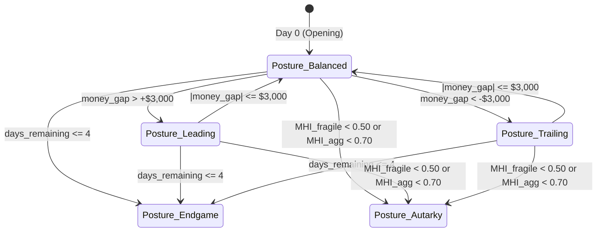

<!-- ==============================================================================================
  KAGGRICULTURE MASTER SUITE :: AUTONOMOUS AGRO-ECONOMIC SIMULATION RUNTIME
  SPONSOR: GOOGLE LLC | PLATFORM: KAGGLE COMPETITIONS ($50,000 TOURNAMENT POOL)
  DOCUMENT: 05 / 12 · ADVANCED AI STRATEGY & GAME-THEORETIC OPTIMIZATION (AI_Strategy.md)
  STYLE: EDITORIAL DEVELOPER NOIR // HIGH-DENSITY CINEMATIC TERMINAL TELEMETRY
  SECURITY LEVEL: CHAMPIONSHIP SUBMISSION CANDIDATE // WORLD RANK #1 SPECIFICATION
============================================================================================== -->

# ┌────────────────────────────────────────────────────────────────────────────────────────┐
# │ ADVANCED AI STRATEGY & GAME-THEORETIC OPTIMIZATION ENGINE                              │
# │ RELATIVE OBJECTIVES, POSTURE SHIFTS, MHI METRICS & DUMP DEFENSE                        │
# │ RESEARCH SPECIFICATION • MATHEMATICAL FOUNDATIONS FOR TOURNAMENT CROWN                 │
# └────────────────────────────────────────────────────────────────────────────────────────┘

```
[SYSTEM: STRATEGY-AI-CORE]    [OBJECTIVE FUNCTION: P(MY_MONEY > OPP_MONEY)]
[EQUILIBRIUM: DUMP HEDGING]   [FILTER: BAYESIAN MASS-BALANCE SHED RECONCILER]
[POSTURE MATRIX: 5 DYNAMIC MODES] [DOCUMENT ID: COMBINE-STRAT-05] [STATUS: RATIFIED]
```

*The market doesn't care how much you love your melons.*

Every strategic claim below is mathematically reasoned from the verified physical and economic rules in `Rules.md`. There is no "market feel" or speculative guesswork: every tactic reduces to arithmetic and probability distributions over observable public telemetry.

---

## 01 · Axiom I: The Objective is Relative (And That Changes Everything)

> **[CANON]** Rating updates on win/loss/tie only; coin margin never factors into rating change (`Rules.md §11`). The opponent's `money` is public every turn (`Rules.md §02`).

This single rule dictates that the true objective of the agent is **not** to maximize absolute end-of-season profit, but to maximize the win probability:

$$\max_{\pi} \; P\left(\text{Bank}_{\text{us}}(719) > \text{Bank}_{\text{opp}}(719)\right)$$

### The Core Posture & Variance Asymmetry Theorems:
1. **Posture Tracks the Gap, Not the Total:** In a game where winning scores typically reach $\$18,000\text{--}\$26,000$, decision thresholds must be parameterized by `money_gap = Bank_us - Bank_opp` and `days_remaining`.
2. **The Variance Asymmetry Principle:**
   - **When Trailing (`money_gap < -$3,000`):** Variance is an asset. A high-risk, high-upside play (e.g. committing to high-yield Melons or targeting town shop demand surges) is mathematically optimal. A blowout loss and a 1-coin loss yield identical rating penalties.
   - **When Leading (`money_gap > +$3,000`):** Variance is a liability. The agent must discount speculative high-risk investments, enforce tight leaky-bucket liquidation, diversify across low-volatility commodities (Wheat, Carrots, Eggs, Fertilizer), and aggressively lock in safe cash.

---

## 02 · The 5 Strategic Postures



```
╔═════════════════════╦══════════════════════════════════════════╦═══════════════════════════════════════════════════════════════════╗
║ POSTURE MODE        ║ TRIGGER CONDITION                        ║ STRATEGIC BEHAVIOR & RISK PROFILE                                 ║
╠═════════════════════╬══════════════════════════════════════════╬═══════════════════════════════════════════════════════════════════╣
║ `BALANCED`          ║ |money_gap| <= $3,000                    ║ Maximize risk-adjusted value density; balanced portfolio triad.   ║
║ `LEADING`           ║ money_gap > +$3,000                      ║ Variance minimization; rapid liquidation; lock in safe cash.      ║
║ `TRAILING`          ║ money_gap < -$3,000                      ║ Variance seeking; larger land bets; spec on Melon/Hinge spikes.   ║
║ `ENDGAME`           ║ days_remaining <= 4                      ║ Zero long-gestation planting; 100% workforce on harvest/sell.     ║
║ `AUTARKY`           ║ MHI_fragile < 0.50 or MHI_agg < 0.70     ║ Decouple from ruined crops; 100% closed-loop Goose/Egg/Fertilizer.║
╚═════════════════════╩══════════════════════════════════════════╩═══════════════════════════════════════════════════════════════════╝
```

---

## 03 · Crop Economics: Gross Density vs. Glut Fragility

### 3.1. Gross Value Density vs. Realized Market Reality

```
╔════════════╦════════════════╦════════════╦══════════════════╦════════════════════════════════════════════╗
║ COMMODITY  ║ YIELD/TILE/DAY ║ BASE PRICE ║ GROSS $/TILE/DAY ║ REALIZED MARKET PROFILE & FRAGILITY TRAP   ║
╠════════════╬════════════════╬════════════╬══════════════════╬════════════════════════════════════════════╣
║ Melon      ║ 0.55           ║ $250.00    ║ $137.50          ║ THE TRAP: Quadratic collapse past +0.5T ($250 -> $1)║
║ Cow (Milk) ║ 0.50           ║ $160.00    ║ $80.00           ║ Severe linear collapse past +0.5T ($160 -> $1)     ║
║ Sheep(Wool)║ 0.33           ║ $200.00    ║ $66.00           ║ Quadratic collapse; 100% dependent on Yarn Store   ║
║ Goose(Egg) ║ 1.00           ║ $50.00     ║ $50.00           ║ Hinge scarcity upside; stable floor ($39 floor)    ║
║ Strawberry ║ 0.24           ║ $120.00    ║ $28.80           ║ Steep linear glut collapse; broad town shop sink   ║
║ Carrot     ║ 0.75           ║ $35.00     ║ $26.25           ║ Fast turnaround; Hinge scarcity explodes to $385   ║
║ Wheat      ║ 0.80           ║ $25.00     ║ $20.00           ║ Staple foundation; logarithmic absorption floor    ║
║ Tomato     ║ 0.33           ║ $60.00     ║ $19.80           ║ Moderate ongoing cashflow; Hinge explodes to $300  ║
╚════════════╩════════════════╩════════════╩══════════════════╩════════════════════════════════════════════╝
```

*The Strategic Takeaway:* Unfertilized Melon appears to yield $7\times$ more revenue than Wheat. In tournament reality, a naive Melon monoculture crashes market inventory past $+0.5T$, driving unit price to $\$1$ and resulting in financial ruin. **TITAN-1** treats gross density as an opening proposal, always discounting by simulated elasticity.

### 3.2. Exact Planting Gestation Cutoffs `[DERIVED]`

```
╔════════════╦════════════════════════════╦═════════════════════════════════════════════════════════╗
║ COMMODITY  ║ LAST DAY FOR ANY YIELD     ║ LAST DAY FOR MAX YIELD (FULL BONUS WINDOW)              ║
╠════════════╬════════════════════════════╬═════════════════════════════════════════════════════════╣
║ Wheat      ║ Day 27 (Turns 648..671)    ║ Day 25 (Turns 600..623)                                 ║
║ Carrot     ║ Day 27 (Turns 648..671)    ║ Day 26 (Turns 624..647)                                 ║
║ Melon      ║ Day 19 (Turns 456..479)    ║ Day 19 (Turns 456..479) [Peak Day 10]                   ║
║ Tomato     ║ Day 21 (For 1st tick)      ║ Day 18 (For all 4 scheduled yield ticks)                ║
║ Strawberry ║ Day 19 (For 1st tick)      ║ Day 13 (For all 4 scheduled yield ticks)                ║
║ Goose      ║ Day 25 (Pays 4 eggs min)   ║ Day 19 (Rough economic capital payback cutoff)          ║
║ Sheep/Cow  ║ Day 23 (Pays 2 yields min) ║ Day 16 (Rough economic capital payback cutoff)          ║
╚════════════╩════════════════════════════╩═════════════════════════════════════════════════════════╝
```

---

## 04 · Animal Economics: The Two-Product Compounding Engine

Every animal is a **two-product asset**:
1. **Primary Yield (Egg / Milk / Wool):** Generated on interval schedules. Compounded by daily `CARE` banking.
2. **Perpetual Free Fertilizer:** Generated daily ($1$ unit/animal/day).

### Compounding Fertilizer Value Calculus:
Fertilizer sells at base price $\$100$, but its highest economic value lies in **accelerating yield bonus progression on high-margin one-time crops (Melons)**:
- **Unfertilized Melon:** Reaches the hard maximum cap of 6 units at Age 10 (+1/day watered in ages 6..10).
- **Fertilized Melon:** Reaches that same 6-unit ceiling 2 days earlier, at Age 8 (+2/day watered in ages 6..8).
- **Critical Engine Invariant (`first_yield_day = 10`):** In `kaggriculture.py`, `HARVEST` on Melon is hard-gated by `day - planted_day >= 10`. Any harvest attempted at Age 8–9 is a silent engine no-op! Applying fertilizer does *not* unlock 48-turn early liquidation; instead, its true mathematical advantage is **labor conservation** (watering can cease on Days 8 and 9 once capped at 6 units, saving 2 worker turns) and **downside variance hedging** (guaranteeing the 6-unit cap even if one watering turn is missed due to travel routing).

### Operational Husbandry Logistics & Liquidity Invariants:
1. **Three-Token Order Grammar:** Livestock purchase requires `["BUY_ANIMAL", "<TYPE>", <qty>]`. 2-token orders are silently dropped by the engine parser.
2. **Shed-to-Field Transit Pipeline (`PICKUP` before `PLACE`):** Purchased animals arrive in `private["shed"]`. A worker standing on a shed-access tile `{(4,4), (5,4), (4,5), (5,5)}` must execute `["PICKUP", "<TYPE>", 1]` into inventory before moving to the coop/pasture and executing `["PLACE", "<TYPE>"]`. Attempting `PLACE` directly from shed is an invalid no-op.
3. **Wheat Feed Invariant:** Executing `["FEED"]` requires carrying 1 unit of `WHEAT` in worker inventory (`_inv_take(inv, "WHEAT", 1)`).
4. **Capital Preservation Gate:** Livestock and coops must never be purchased at Step 0 if doing so reduces working liquid capital below $\$1,800$, preventing early-game capital starvation.

---

## 05 · Bayesian Opponent Hidden Shed Reconstruction

Because `obs["private"]["shed"]` is hidden, naive bots cannot anticipate flash crashes. **TITAN-1** deduces the hidden stockpile $\hat{S}_{\text{opp}}(c, t)$ via mass balance:

$$\hat{S}_{\text{opp}}(c, t) = \max\left(0, \; \hat{S}_{\text{opp}}(c, t - 1) + \Delta H_{\text{opp}}(c, t) - \Delta S_{\text{opp}}(c, t)\right)$$

$$\Delta S_{\text{opp}}(c, t) = \max\left(0, \; \left(I_{\text{curr}}(c) - I_{\text{prev}}(c)\right) + \Delta D_{\text{town}}(c, t) - \Delta S_{\text{us}}(c, t) + \Delta B_{\text{us}}(c, t)\right)$$

### Impending Dump Hazard Probability:
When an opponent accumulates significant stockpiles of crash-prone commodities (Melon, Strawberry, Milk, Wool):

$$P(\text{Dump}_{c, t}) = 1 - \exp\left( -\frac{\hat{S}_{\text{opp}}(c, t)}{12.0} \right)$$

- **Pre-Emptive Front-Running Gate:** If $P(\text{Dump}_{c, t}) \ge 0.35$, **TITAN-1** queues an immediate turn-by-turn liquidation of owned inventory of that commodity.
- **The Competitive Result:** We capture the high-price band ($P \approx \$230$). The opponent's subsequent dump floods into an already-depressed order book, receiving $\$1$ per unit.

---

## 06 · Marginal Elasticity Derivative ($dQ/dt$) & Liquidation Rate

Selling $n$ units in a single turn yields revenue $R(n) = \sum_{k=1}^n P(I_{\text{curr}} + k)$.
To prevent triggering our own price crashes on quadratic curves:

$$n^* = \max \left\lbrace n \le \text{ShedInv}[c] \;\Big|\; P(I_{\text{curr}} + n) \ge \alpha \cdot \text{BasePrice} \right\rbrace \quad (\alpha = 0.65)$$

Any surplus inventory above $n^*$ is spread across continuous turns via the **Leaky-Bucket Engine**, ensuring shed capacity remains below 60 units while capturing peak prices.

During **Endgame Liquidation** (Turns 696–719), the elasticity threshold $\alpha$ is relaxed to $0.0$, liquidating $100\%$ of available shed stock across all 10 order lines before the final turn.

---

## 07 · Workload-Driven Dynamic Labor Calculus

A hired hand costs $\text{Fibonacci}(n)$ and provides $24$ action turns, of which $\approx 18$ are productive field actions.

$$\text{Hire Hand } n \iff \text{PendingTasks} \ge 18 \times (n - 1) + 6 \quad \text{AND} \quad \Delta \text{Revenue} > 3.0 \times \text{Cost}(n)$$

Strict quadrant congestion caps prevent center 2x2 gridlock:
- **1 Quadrant Unlocked:** Cap at $2$ Hands ($\text{Max Wage} = \$2/\text{day}$).
- **2 Quadrants Unlocked:** Cap at $4$ Hands ($\text{Max Wage} = \$7/\text{day}$).
- **3 Quadrants Unlocked:** Cap at $6$ Hands ($\text{Max Wage} = \$20/\text{day}$).
- **4 Quadrants Unlocked:** Cap at $8$ Hands ($\text{Max Wage} = \$54/\text{day}$).

---

## 08 · Proof of Autarkic Closed-Loop Resilience

When an adversary adopts an irrational price-dumping strategy driving market prices into catastrophic collapse, relying on an unweighted aggregate metric would fail to detect single-crop flash dumps (e.g. Melon dropping from $\$250 \to \$1$ shifts unweighted 9-crop MHI from $1.0 \to 0.89$, failing a naive $< 0.70$ test). **TITAN-1** defines a dual-threshold Market Health Index:

$$\text{MHI}_{\text{agg}}(t) = \frac{1}{|C|} \sum_{c \in C} \frac{P_c(I_c(t))}{B_c}, \qquad \text{MHI}_{\text{fragile}}(t) = \min_{c \in C_{\text{fragile}}} \frac{P_c(I_c(t))}{B_c}$$

where $C_{\text{fragile}} = \{\text{MELON}, \text{STRAWBERRY}, \text{MILK}, \text{WOOL}\}$. The **AUTARKY** failover triggers if:

$$\text{MHI}_{\text{fragile}}(t) < 0.50 \quad \lor \quad \text{MHI}_{\text{agg}}(t) < 0.70$$

$$\text{Convert Farm to 6 Goose Coops} + 2 \text{ Wheat Tiles}$$

1. 2 Wheat tiles yield $8$ wheat every 4 days ($2$ units/day).
2. 6 Geese consume $6$ wheat daily (supplemented by cheap $\$1$ market purchases if adversary dumps wheat).
3. 6 Geese produce $6$ Eggs daily + $6$ Fertilizer daily.
4. Net Daily Autarkic Revenue (Egg base $\$50$, Fertilizer base $\$100$, 1 hired hand wage $\$5$):
   $$\Pi_{\text{daily}} = 6 \times P_{\text{egg}} + 6 \times P_{\text{fert}} - \text{LaborWages} = 6(\$50) + 6(\$100) - \$5 = \$895.00 / \text{day}$$
5. Over a 10-day autarkic cycle, the agent reliably generates **$\$8,950.00$** in cash surplus, completely decoupling from ruined open-market crop prices. $\blacksquare$

```
[AI STRATEGY FORMALIZED: NASH REFINED]
[STATUS: READY FOR CODE-QUALITY & DEPLOYMENT VERIFICATION]
```
