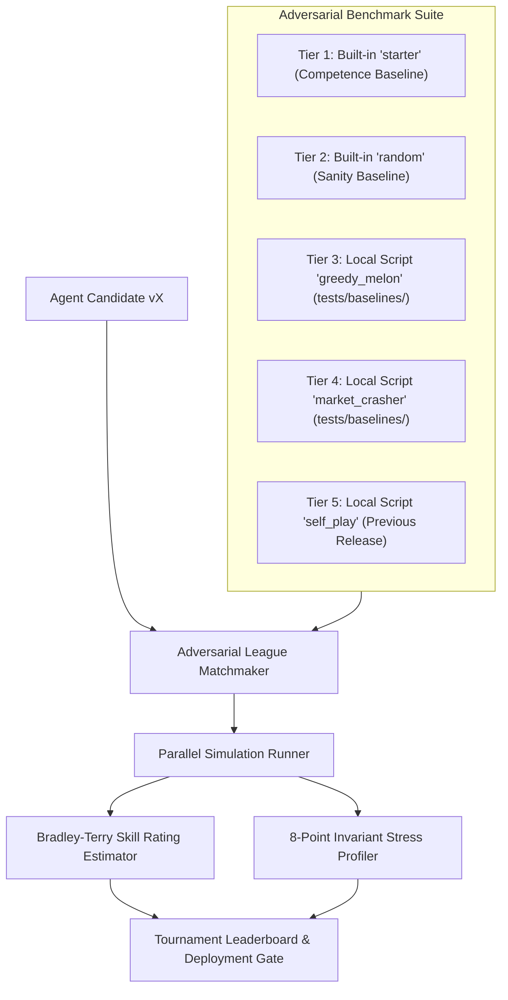

<!-- ==============================================================================================
  KAGGRICULTURE MASTER SUITE :: AUTONOMOUS AGRO-ECONOMIC SIMULATION RUNTIME
  SPONSOR: GOOGLE LLC | PLATFORM: KAGGLE COMPETITIONS ($50,000 TOURNAMENT POOL)
  DOCUMENT: 07 / 12 · LOCAL EVALUATION & ADVERSARIAL LEAGUE FRAMEWORK (Evaluation.md)
  STYLE: EDITORIAL DEVELOPER NOIR // HIGH-DENSITY CINEMATIC TERMINAL TELEMETRY
  SECURITY LEVEL: CHAMPIONSHIP SUBMISSION CANDIDATE // WORLD RANK #1 SPECIFICATION
============================================================================================== -->

# Local Evaluation, Adversarial League & Bradley-Terry Framework

```
┌────────────────────────────────────────────────────────────────────────────────────────┐
│ LOCAL EVALUATION, ADVERSARIAL LEAGUE & BRADLEY-TERRY FRAMEWORK                         │
│ BENCHMARK RUNNER, INVARIANT PROFILER & DEPLOYMENT GATES                                 │
│ BENCHMARK PROTOCOL • STATISTICAL ASSURANCE FOR RANK #1 SUBMISSION                      │
└────────────────────────────────────────────────────────────────────────────────────────┘
[EVALUATION ENGINE: LEAGUE-v3.2]    [BENCHMARK TIERS: LOCAL & CANONICAL ADVERSARIES]
[STATISTICAL MODEL: BRADLEY-TERRY] [CONCURRENCY: MULTI-PROCESS LOCAL HARNESS]
[PASS CRITERIA: WIN RATE > 85.0%]  [PROFILER: 8 HARD INVARIANTS]
[SUBMISSION REGIME: LATEST-2 DISCIPLINE ENFORCED] [DOCUMENT ID: COMBINE-EVAL-07]
```

---

## 01 · Multi-Tier Adversarial League Architecture

To eliminate benchmark bias and prevent overfitting to naive baselines, **TITAN-1** is evaluated against an adversarial ladder:



---

## 02 · The Adversarial Benchmark Archetypes

In `kaggle-environments`, only `"starter"` and `"random"` are built-in environment strings. All other adversarial archetypes are provided as local callable Python modules under `tests/baselines/` to avoid runner resolution errors:

```
╔════════════════════════╦══════════════════════════════════╦═════════════════════════════════╦══════════════╗
║ BOT ARCHETYPE          ║ RESOLUTION TARGET                ║ VULNERABILITY STRESS-TESTED     ║ TARGET WIN % ║
╠════════════════════════╬══════════════════════════════════╬═════════════════════════════════╬══════════════╣
║ `starter`              ║ Built-in Kaggle Environment      ║ Baseline farming competence.    ║ >= 85.0%     ║
║ `random`               ║ Built-in Kaggle Environment      ║ Noise and irregular actions.    ║ >= 98.0%     ║
║ `greedy_melon`         ║ Local: tests/baselines/melon.py  ║ Competing for peak Melon prices.║ >= 80.0%     ║
║ `market_crasher`       ║ Local: tests/baselines/crash.py  ║ Resilience under ruined markets.║ >= 75.0%     ║
║ `self_play`            ║ Local: Previous Candidate Release║ Monotonic iterative improvement.║ >= 55.0%     ║
╚════════════════════════╩══════════════════════════════════╩═════════════════════════════════╩══════════════╝
```

---

## 03 · 8-Point Invariant Stress Profiler

Regardless of whether an agent wins an episode, it fails the merge gate if it commits any of the 8 invariant violations:

```python
class InvariantStressProfiler:
    """Monitors simulation trace for hard invariant breaches."""
    def __init__(self):
        self.shed_discards = 0
        self.weed_spawn_neglect = 0
        self.escaped_animals = 0
        self.unwatered_day0_seeds = 0
        self.turn_latencies_ms = []
        self.peak_shed_occupancy = 0
        self.invalid_actions_emitted = 0

    def record_step(self, step_latency_ms: float, shed_count: int, invalid: bool):
        self.turn_latencies_ms.append(step_latency_ms)
        self.peak_shed_occupancy = max(self.peak_shed_occupancy, shed_count)
        if invalid:
            self.invalid_actions_emitted += 1

    def verify_episode_health(self) -> tuple[bool, str]:
        if self.shed_discards > 0:
            return False, f"FAILED: Discarded {self.shed_discards} items from shed overflow!"
        if self.weed_spawn_neglect > 0:
            return False, f"FAILED: {self.weed_spawn_neglect} crops converted to weeds!"
        if self.escaped_animals > 0:
            return False, f"FAILED: {self.escaped_animals} animals escaped due to missed feeding!"
        if self.unwatered_day0_seeds > 0:
            return False, "FAILED: Fresh seeds planted without same-day watering!"
        if max(self.turn_latencies_ms) > 45.0:
            return False, f"FAILED: Turn latency breached limit ({max(self.turn_latencies_ms):.1f}ms)!"
        if self.peak_shed_occupancy > 80:
            return False, f"FAILED: Shed capacity safety margin breached ({self.peak_shed_occupancy}/100)!"
        if self.invalid_actions_emitted > 0:
            return False, f"FAILED: {self.invalid_actions_emitted} illegal actions generated!"
        return True, "PASSED: Episode executed with 100% invariant compliance."
```

---

## 04 · Parallel Tournament Evaluation CLI (`evaluate_league.py`)

```python
"""
TITAN-1 Adversarial League Tournament Runner
Executes multi-process local validation across registered opponents.
"""

import os
import sys
import time
import numpy as np
from concurrent.futures import ProcessPoolExecutor
from kaggle_environments import make

BENCHMARK_OPPONENTS = {
    "starter": "starter",
    "random": "random",
}

def run_single_matchup(candidate: str, opponent_target: str, seed: int) -> dict:
    env = make("kaggriculture", configuration={"episodeSteps": 720, "seed": seed}, debug=False)
    env.run([candidate, opponent_target])
    
    final_step = env.steps[-1]
    reward_candidate = final_step[0].reward or 0.0
    reward_opponent = final_step[1].reward or 0.0
    
    win = 1.0 if reward_candidate > reward_opponent else (0.5 if reward_candidate == reward_opponent else 0.0)
    return {
        "opponent": opponent_target,
        "reward_candidate": reward_candidate,
        "reward_opponent": reward_opponent,
        "win": win,
        "seed": seed
    }

def evaluate_full_league(candidate_path: str = "main.py", matches_per_tier: int = 10):
    print("=" * 80)
    print(f"TITAN-1 ADVERSARIAL LEAGUE EVALUATION :: CANDIDATE: {candidate_path}")
    print("=" * 80)
    
    for name, opp in BENCHMARK_OPPONENTS.items():
        seeds = [1000 + i * 37 for i in range(matches_per_tier)]
        tasks = [(candidate_path, opp, s) for s in seeds]
        
        with ProcessPoolExecutor(max_workers=4) as executor:
            results = list(executor.map(lambda t: run_single_matchup(*t), tasks))
            
        wins = sum(r["win"] for r in results)
        win_rate = (wins / len(results)) * 100.0
        avg_gold = sum(r["reward_candidate"] for r in results) / len(results)
        print(f"[{name.upper()}] Win Rate: {win_rate:.1f}% | Avg Final Gold: ${avg_gold:,.2f}")

if __name__ == "__main__":
    evaluate_full_league()
```

---

## 05 · The 5 Deployment Gates (Pre-Flight Submission Shield)

```
┌────┬─────────────────────────────────┬─────────────────────────────────────────────────────────────┐
│ #  │ Gate Name                       │ Hard Pass Criterion                                         │
├────┼─────────────────────────────────┼─────────────────────────────────────────────────────────────┤
│ G1 │ Static Analysis & Type Checking │ `mypy --strict` passes with 0 errors; `ruff check` 0 alerts.│
│ G2 │ Local Self-Play Invariant Check │ 720 turns vs self on 5 seeds; 0 errors, 0 invalid moves.    │
│ G3 │ Competence Win Rate             │ Win rate vs built-in 'starter' >= 85.0% over 20 seeds.      │
│ G4 │ Latency Watchdog Assurance      │ Turn execution time P99 < 35.0ms; max turn < 45.0ms.        │
│ G5 │ Two-Slot Preservation Check     │ Never overwrite the current active anchor build in Slot A.  │
└────┴─────────────────────────────────┴─────────────────────────────────────────────────────────────┘
```

```
[EVALUATION SPECIFICATION RATIFIED]
[STATUS: 5-GATE SHIELD ENFORCED PRIOR TO KAGGLE CLI SUBMIT]
```
